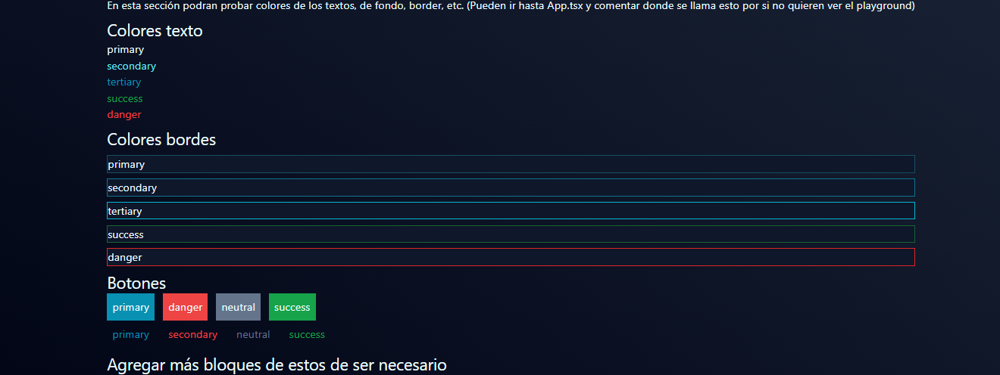
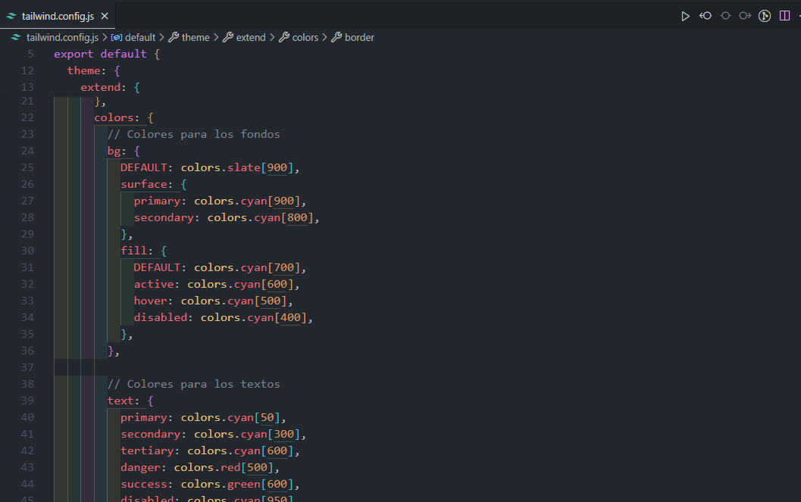

# DOCUMENTACIÓN

## Como iniciar la aplicación

- Tener instalado node js y npm
- Instalar dependencias:

```javascript
npm install
```

- Iniciar la aplicación con el comando en modo desarrollo

```javascript
npm run dev
```

## Colores

Colores definidos

### Los únicos colores que vamos a usar son:



#### Si quieren ver todos los colores disponibles ver tailwind.config.js



## ¿Con que se está estilizando?

- Principalmente con [tailwind](https://tailwindcss.com/)
- Se usa componentes ya hechos con tailwind y react usando la librería [flowbite react](https://flowbite-react.com/) aquí puedes buscar los componentes, copiar y pegar
- Además tambien se usa [flowbite](https://flowbite.com/) por si solo en el caso que flowbite react no tenga lo necesario o se quiera más versatilidad, aquí también puedes copiar y pegar componentes

## ¿Cómo están organizadas las carpetas y que archivos se encontrarán?

- assets: Todos los archivos multimedia (Imagenes, svg, etc)
- components: Componentes que usarán en más de un lugar de la aplicación
- context: Aquí estarán funcionalidades que permitiran que x información (Ejemplo: información del usuario) se mantenga durante toda la aplicación sin importar si se cambia a otra página
- layouts: Contenedores de página relacionadas (para el contenido público, para el contenido privado)
- pages: Donde estarán las páginas de la aplicacióin
  - Aqui podras encontrar la página principal
  - Componentes que solo se usaran aqui
  - Hooks que solo serán usados aquí
- utils: Aquí se encontraran funcionalidades que se podrán usar en toda la aplicación, que no necesariamente son componentes (No tiene un HTML)

## Algunos archivos importantes para tener en cuenta

- App.tsx: Aquí se manejaran las rutas entre otras cosas de la aplicación (Autenticaciones, etc)
- main.tsx: punto de entrada de la aplicación
- index.css: Donde se importa lo necesario para usar tailwind, tambiénm se pueden agregar estados globales
- index.html: Punto de entrada de la aplicación en cuanto al HTML (No se toca)
- package.json: encontraremos las dependencias descargadas, información del proyecto, etc.

## ¿Y el temas de las rutas?

- Se usa react-router-dom
- Puedes encontrar todas las rutas disponibles desde el archivo que está en utils/constanst/paths

## ¿Qué estandares buscamos seguir?

- Se busca que el código esté en inglés
- Que se haga uso del modelo branching para el uso de las ramas en git
- No repetición de código
- Entre otras cosas

# ¿Cómo vamos a hacer las peticiones?

Vamos a utilizar este método llamado fetchMethod

Ejemplo básico de su uso:

```javascript
  import React, { useEffect, useState } from 'react';

// Suponiendo que has importado fetchMethod y los enums
import { fetchMethod, MethodType, ResponseType } from './path/to/fetchMethod';

const UserList: React.FC = () => {
    const [users, setUsers] = useState<User[]>([]);
    const [loading, setLoading] = useState<boolean>(true);
    const [error, setError] = useState<string | null>(null);

    useEffect(() => {
        const fetchUsers = async () => {
            try {
                // Realiza la solicitud GET
                const data = await fetchMethod<User[]>('https://api.example.com/users', MethodType.GET);
                setUsers(data); // Asigna la respuesta al estado
            } catch (error) {
                setError('Error al obtener usuarios');
                console.error('Error fetching users:', error);
            } finally {
                setLoading(false); // Finaliza la carga
            }
        };

        fetchUsers();
    }, []);

    if (loading) {
        return <p>Cargando usuarios...</p>;
    }

    if (error) {
        return <p>{error}</p>;
    }

    return (
        <ul>
            {users.map((user) => (
                <li key={user.id}>
                    {user.name} - {user.email}
                </li>
            ))}
        </ul>
    );
};

export default UserList;

```

Código de la función

```javascript
enum MethodType {
	GET = 'GET',
	POST = 'POST',
	PUT = 'PUT',
	DELETE = 'DELETE',
}

enum ResponseType {
	JSON = 'json',
	BLOB = 'blob',
	TEXT = 'text',
}

export const fetchMethod = async <T>(
	url: string,
	method: MethodType = MethodType.GET,
	body: object | null = null,
	responseType: ResponseType = ResponseType.JSON,
	options: RequestInit = {},
	requireAuth: boolean = true
): Promise<T> => {
	const token = requireAuth ? localStorage.getItem('token') : null;

	const headers: HeadersInit = {
		'Content-Type': 'application/json',
		...(token && { Authorization: `Bearer ${token}` }),
		...(options.headers || {}),
	};

	const requestOptions: RequestInit = {
		method,
		headers,
		...options,
	};

	if (body !== null && typeof body === 'object') {
		requestOptions.body = JSON.stringify(body);
	}

	try {
		const response = await fetch(url, requestOptions);

		if (!response.ok) {
			throw new Error(
				`Error en la solicitud a ${url}: ${response.statusText} (Status: ${response.status})`
			);
		}

		switch (responseType) {
			case ResponseType.JSON:
				return (await response.json()) as T;
			case ResponseType.BLOB:
				return (await response.blob()) as unknown as T;
			case ResponseType.TEXT:
				return (await response.text()) as unknown as T;
			default:
				throw new Error('Tipo de respuesta no soportado');
		}
	} catch (error) {
		console.error('Error en la solicitud:', error);
		throw error;
	}
};

```

# Mensajes flotantes

[Página de los toast](https://react-hot-toast.com/)


## Este readme se estará actualizando...
